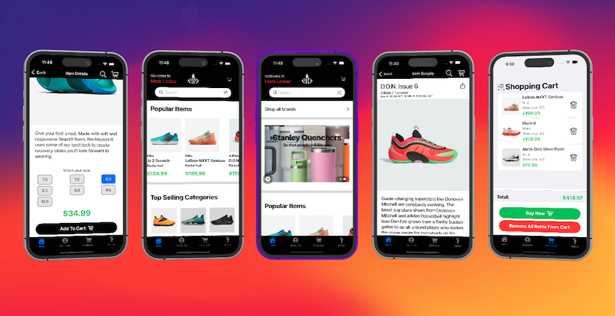

# Mock Locker

[](https://github.com/randyvarela5/Mock-Locker/actions/workflows/test.yaml)  
[](https://github.com/randyvarela5/Mock-Locker/commits/main)   
  
  
  

Mock Locker is a SwiftUI-based mock e-commerce app inspired by Foot Locker. This app is designed for educational and demonstration purposes to showcase SwiftUI development, modern UI design, and e-commerce features. It is not intended for production or public release.

## 📸 Screenshots



## 🚀 Features

🛍️ Browse a catalog of mock sneakers and apparel

🔍 Search for products by name or category

🧾 View product details, including price, description, and images

❤️ Add items to a Favorites list (local state)

🛒 Cart management (mock checkout experience)

🔐 User authentication with Firebase (login + password reset)

🗺️ Store locator (uses MapKit with mock data)


## 🛠️ Technologies Used

Language: Swift

Framework: SwiftUI

Authentication: Firebase Auth  

CI/CD: GitHub Actions  

Architecture: MVVM

Data Handling: Local mock JSON

Other APIs: MapKit, SF Symbols, AlertToast

Deployment Target: iOS 15+


## 📈 Roadmap
The following features and improvements are currently in progress or planned for future updates:

🗺️ Store Locator using MapKit and mock store data

🌗 Dark Mode support using dynamic system colors

🔐 Improved authentication UX (loading states, error handling)

💬 Toast notifications for key actions (e.g. login success, add to cart)

🧹 Codebase cleanup (refactoring views, modularizing view models)

🧪 Expanded unit test coverage for critical features

## 📦 Installation

1. Clone the repo:
   ```bash
   git clone https://github.com/randyvarela5/Mock-Locker.git


2. Open the project:

Open MockLocker.xcodeproj in Xcode (version 14 or later recommended).


3. Install dependencies:

Add your Firebase GoogleService-Info.plist file to the root of the project (if using Firebase).

No external package manager (like CocoaPods or SwiftPM) is currently required.


4. Run the app:

Select an iOS simulator (or real device) and hit Run (⌘R).
